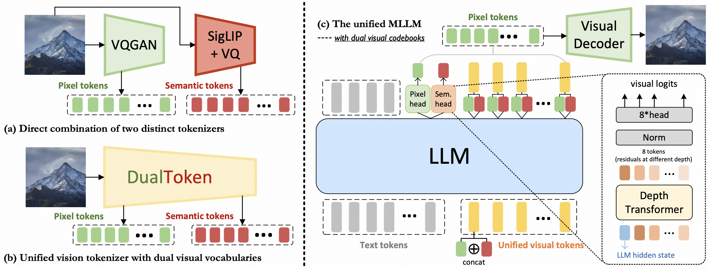

<h2 align="center"> <a href="https://arxiv.org/abs/2503.14324">DualToken: Towards Unifying Visual Understanding and Generation<br>with Dual Visual Vocabularies</a></h2>
<h5 align="center"> If our project helps you, please give us a star ⭐ and cite our <a href="#citation">paper</a>!</h2>
<h5 align="center">

<a href="https://arxiv.org/abs/2503.14324"></a>
<a href=""></a>
<a href=""></a>
</div>

<div style="display: flex; justify-content: center;">  
    
      
</div>

## Introduction

This repo implements **DualToken**, a method that unifies representations for both visual understanding and generation within a single tokenizer. Directly integrating reconstruction and semantic objectives in a single tokenizer creates conflicts, leading to degraded performance in both reconstruction quality and semantic performance. Instead of forcing a single codebook to handle both semantic and perceptual information, DualToken disentangles them by introducing separate codebooks for high and low-level features, effectively transforming their inherent conflict into a synergistic relationship. As a result, DualToken achieves state-of-the-art performance in both reconstruction and semantic tasks.


Built upon DualToken, we construct an unified MLLM which demonstrates remarkable effectiveness in downstream understanding and generation tasks. The code and weights of our unified MLLM will be released soon.



## News
- **[2025/03/19]** 🌟 We have released the code and model weights of our tokenizer. More versions are scheduled to be updated. Please stay tuned!
- **[2025/03/18]** 🌟 We have released the technical report of **DualToken**. See [here](https://arxiv.org/abs/2503.14324)!


> Coming soon & Stay tuned! 🚀

## Requirements and Installation

## Model Zoo
* [Tokenizer (embed_dim = 256)](https://drive.google.com/file/d/16-v2skUaDKUSvLo4Zf1OX_9ElGgFVDQN/view?usp=drive_link): This preview version features a embedding dimension of 256, with more advanced versions planned for future updates.

## Inference


## Acknowledgement
DualToken is built upon the awesome works 
[VILA-U](https://github.com/mit-han-lab/vila-u),
[OpenCLIP](https://github.com/mlfoundations/open_clip),
and [LLaVA](https://github.com/haotian-liu/LLaVA/).


## LICENSE

This project is licensed under the MIT License - see the [LICENSE](LICENSE) file for details.

## Citation

```bibtex
@article{song2025dualtoken,
  title={DualToken: Towards Unifying Visual Understanding and Generation with Dual Visual Vocabularies}, 
  author={Song, Wei and Wang, Yuran and Song, Zijia and Li, Yadong and Sun, Haoze and Chen, Weipeng and Zhou, Zenan and Xu, Jianhua and Wang, Jiaqi and Yu, Kaicheng},
  journal={arXiv preprint arXiv:2503.14324},
  year={2025} 
}
```
